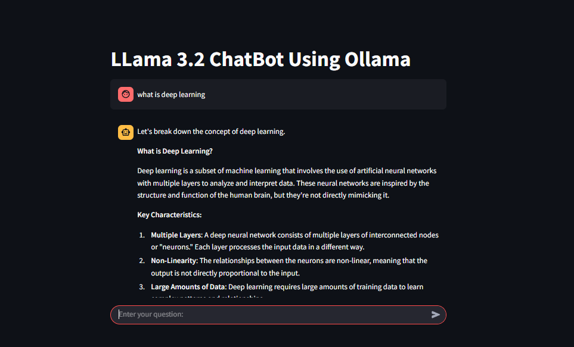

# LLama 3.2 ChatBot


## Overview
This is a simple and interactive chatbot application built with Streamlit and powered by the LLama 3.2 model through Ollama. The chatbot provides a conversational interface where users can ask questions and receive thoughtful, step-by-step responses.

## Features
- Clean, WhatsApp-like chat interface
- Persistent conversation history within a session
- Real-time responses from LLama 3.2 model
- Streamlined user experience with intuitive input field

## Requirements
- Python 3.7+
- Streamlit
- LangChain
- Ollama with LLama 3.2 model installed

## Installation

1. Clone this repository:
    ```bash
    git clone https://github.com/your-username/llama-chatbot.git
    cd llama-chatbot
    ```

2. Install the required dependencies:
    ```bash
    pip install -r requirements.txt
    ```

3. Ensure you have Ollama installed and the LLama 3.2 model set up:
    ```bash
    ollama install llama-3.2
    ```

4. Run the Streamlit application:
    ```bash
    python -m streamlit run app.py
    ```

## Usage
- Open the Streamlit app in your browser.
- Type your query in the input field and press Enter.
- The chatbot will respond in real-time.


